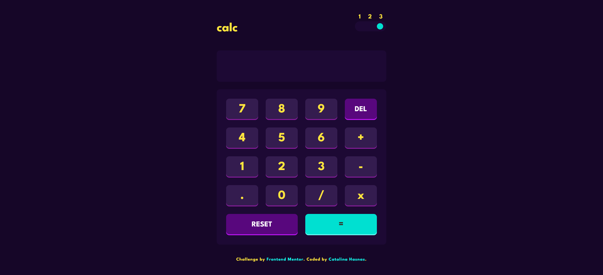
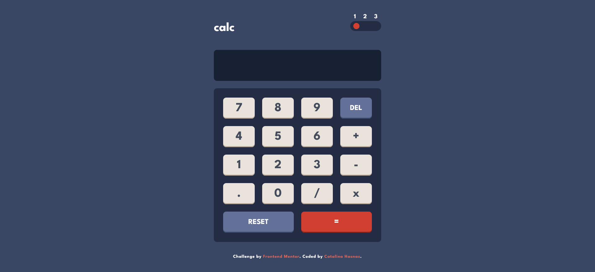
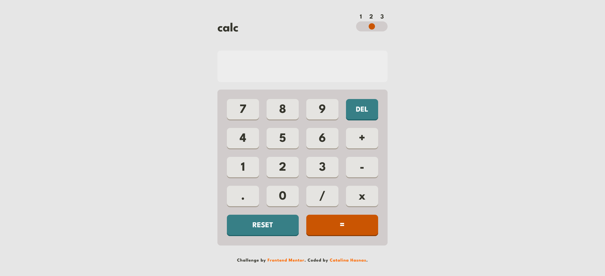
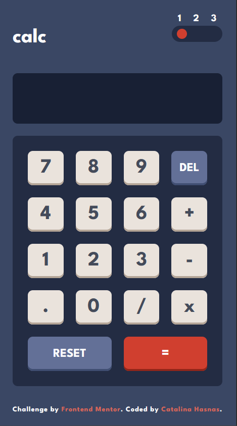
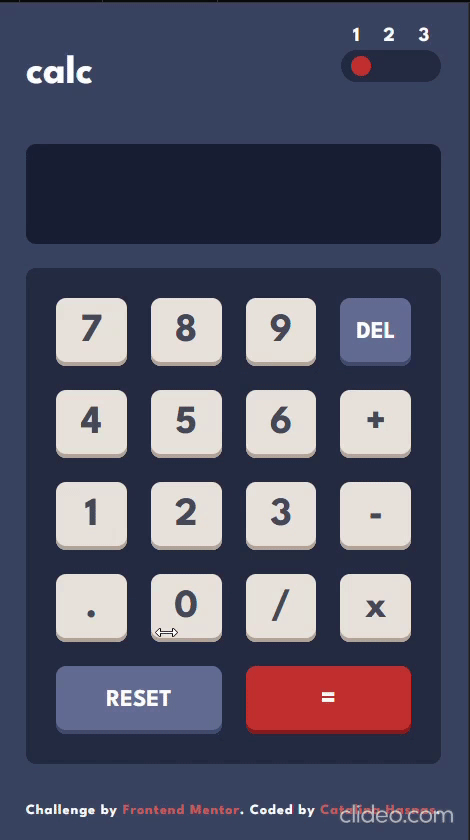

# Frontend Mentor - Calculator app solution

This is a solution to the [Calculator app challenge on Frontend Mentor](https://www.frontendmentor.io/challenges/calculator-app-9lteq5N29) using HTMl, CSS and Javascript.

## Table of contents

- [Overview](#overview)
  - [The challenge](#the-challenge)
  - [Screenshots](#screenshots)
  - [Links](#links)
- [My process](#my-process)
  - [Built with](#built-with)
  - [Highlights](#highlights)
    - [Theme toggler](#theme-toggler)
    - [Operations with negative numbers](#operations-with-negative-numbers)
- [Continued development](#continued-development)
- [Author](#author)
- [Acknowledgments](#acknowledgments)

## Overview

### The challenge

Users are able to:

- Toggle between 3 themes: `default`, `light` and `dark` themes
- Do arithmetic operations, including operations with negative numbers, for example: -2+1, 1+-2, -2+-2, -2--2;
- Remove the last character that was typed on **DEL** click
- Reset the calculator on **RESET** click

### Screenshots

Desktop:







Mobile:



### Links

- Solution URL: [Calculator with negative numbers](https://www.frontendmentor.io/solutions/calculator-with-negative-numbers-yRBay_pAp6)
- Live Site URL: (https://catalina-hasnas.github.io/calculator-app-main/)

## My process

### Built with

- HTML5
- CSS
- Javascript

### Highlights

#### Theme toggler

For this challenge I used a button for toggling between themes with custom `aria-label` for accessibility.
A simple CSS solution that I found is to have a child (circle) inside the parent button with position: absolute and change its left position on each click. This has the added benefit of the `left` property being easy to animate.

```css
#toggler-button {
  ...
  position: relative;
}

#circle {
  ...
  position: absolute;
  top: 50%;
  left: 20%;
  transform: translate(-50%, -50%);
  transition: left 200ms;
}
```

The visual effect of the circle changing its position as the theme is toggled is achieved by using a combination of CSS and Javascript.

```js
const onTogglerButtonClick = (event) => {
  event.preventDefault();
  if (circlePosition === 3) {
    circlePosition = 1;
  } else {
    circlePosition++;
  }
  mapCirclePositionToThemeValue();
};

const circlePositionToThemeValueMapper = {
  1: { theme: "default", leftPosition: "20%" },
  2: { theme: "light", leftPosition: "50%" },
  3: { theme: "dark", leftPosition: "80%" },
};
```

The "data-color-scheme" attribute is changed on the `body` element depending on the circle position. This sets the root variables values according to the attribute name. The left position of the `circle` element is also set.

```css
[data-color-scheme="light"] {
  color-scheme: light;
  --main-background: var(--main-background-light);
  --keypad-background: var(--keypad-background-light);
  ...;
}

[data-color-scheme="dark"] {
  color-scheme: dark;
  --main-background: var(--main-background-dark);
  --keypad-background: var(--keypad-background-dark);
  ...;
}
```

#### Operations with negative numbers

The synthantic sugar of a javascript class was used for simplicity. It has three main properties `currentOperand` representing the left hand-side of the operation, `previousOperand` for the right hand-side and `operator` in the middle.

The `compute` function calculates the result of the operation on click on "equals" button, as well as operator button, if both operands are present.

If there's no currentOperand, ignore the click (such as when you click `+` on an empty screen). Except when the operand is minus. Then, minus becomes the first character of `currentOperand`, later to be updated in the `updateCurrentOperand` function.

```js
class Calculator {
    constructor(currentScreenTextElement) {
    this.currentScreenTextElement =
    currentScreenTextElement;
    this.currentOperand = "";
    this.previousOperand = "";
    this.operator = "";
    }

    updateOperator(operator) {
        if (operator === minus) {
        if (!this.currentOperand) {
            this.currentOperand = minus;
            return;
        }
        }
        if (!this.currentOperand) {
        return;
        }
        if (this.previousOperand) {
        this.compute();
        }
        this.operator = operator;
        this.previousOperand = this.currentOperand;
        this.currentOperand = "";
    }
    ...
}
```



### Continued development

I would like to refactor this project to use SASS mixins for the theme toggling.

## Author

- LinkedIn - [Catalina Hasnas](https://www.linkedin.com/in/catalina-hasnas-7481731b8/)
- Frontend Mentor - [@Catalina-Hasnas](https://www.frontendmentor.io/profile/Catalina-Hasnas)

## Acknowledgments

Thanks to the author of [this article](https://medium.com/swlh/building-a-calculator-with-javascript-adbf8e8cf56f)! Although similar to my initial solution, the one from the article that uses a class is much cleaner.
